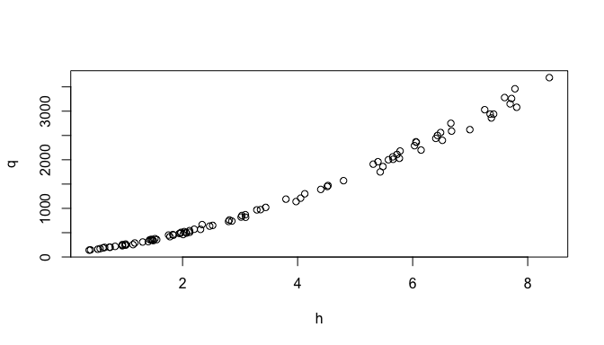
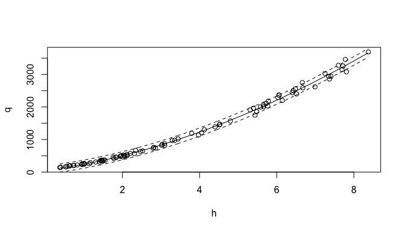

<!-- README.md is generated from README.Rmd. Please edit that file -->

# CSHShydRometry

<!-- badges: start -->

[](https://github.com/CSHS-CWRA/CSHShydRometry/actions/workflows/R-CMD-check.yaml)
[](https://app.codecov.io/gh/CSHS-CWRA/CSHShydRometry)
[](https://cran.r-project.org/web/licenses/MIT)
<!-- badges: end -->

A rating curve turns a river’s stage (its water level, which is easy to
record continuously) into discharge (the flow, which is not). It is
fitted to gaugings: occasions when both were measured. This package fits
rating curves by a range of statistical methods, and puts confidence and
prediction limits on them.

It is derived from work by Dan Moore on rating-curve methods.

## Installation

``` r
remotes::install_github("CSHS-CWRA/CSHShydRometry")
```

## The data

The package comes with 93 gaugings from the Thompson River (Water Survey
of Canada station 08LF051). `h` is the stage in metres, `q` the
discharge in cubic metres per second.

``` r
library(CSHShydRometry)
head(thompson)
#>         date     h   q  uq
#> 1 2023-03-22 0.376 141  NA
#> 2 2023-01-11 0.399 146 2.6
#> 3 2014-03-05 0.526 160  NA
#> 4 2011-02-25 0.567 172  NA
#> 5 2001-04-02 0.618 187  NA
#> 6 1995-03-17 0.645 197  NA
```

Discharge rises faster than linearly with stage:

``` r
plot(q ~ h, data = thompson)
```



## Fitting a curve

The classic rating curve is a power law, `q = a * (h - c)^b`. `rc_nls()`
fits it by nonlinear least squares:

``` r
fit <- rc_nls(q, h, data = thompson)
coef(fit)
#>          a          b          c 
#> 80.6686684  1.7131160 -0.9044139
```

Here `c` is the stage at which the flow would stop, and `b` says how
quickly the flow grows above it.

## Predicting discharge

`predict()` evaluates the curve at the stages you give it:

``` r
predict(fit, hpred = c(1, 3, 6))
#> # A tibble: 3 × 2
#>       h   fit
#>   <dbl> <dbl>
#> 1     1  243.
#> 2     3  832.
#> 3     6 2209.
```

Ask for a confidence level to get limits for the curve itself, and a
prediction level to get limits for a new gauging:

``` r
predict(fit, hpred = c(1, 3, 6), conflev = 0.95, predlev = 0.95)
#> # A tibble: 3 × 6
#>       h   fit ci_lwr ci_upr pi_lwr pi_upr
#>   <dbl> <dbl>  <dbl>  <dbl>  <dbl>  <dbl>
#> 1     1  243.   222.   264.   118.   368.
#> 2     3  832.   814.   850.   707.   957.
#> 3     6 2209.  2188.  2230.  2084.  2334.
```

Leave out `hpred` to cover the whole range of the gaugings, which is
handy for plotting:

``` r
band <- predict(fit, conflev = 0.95, predlev = 0.95)

plot(q ~ h, data = thompson)
lines(fit ~ h, data = band)
lines(pi_lwr ~ h, data = band, lty = 2)
lines(pi_upr ~ h, data = band, lty = 2)
```



The dashed lines are the 95% prediction limits. The confidence limits
are there too, in `ci_lwr` and `ci_upr`, but on this scale they sit
almost on the curve.

## Other models

Every model has an `rc_*()` function and a `predict()` method:

- `rc_nls()`: power law, fitted on the natural scale.
- `rc_log_ols()`, `rc_log_nls()`: power law, fitted on the log–log
  scale.
- `rc_gnls()`: power law, with the scatter estimated as a power of the
  flow.
- `rc_poly()`, `rc_loess()`: a polynomial, or a smooth curve.
- `rc_nls_2seg()`: two power laws joined at a breakpoint (more below).

Swapping one model for another changes one line:

``` r
fit_poly <- rc_poly(q, h, data = thompson)
predict(fit_poly, hpred = c(1, 3, 6))
#> # A tibble: 3 × 2
#>       h   fit
#>   <dbl> <dbl>
#> 1     1  244.
#> 2     3  835.
#> 3     6 2201.
```

`predict()` always gives back the same columns, so results from
different models can be stacked with `rbind()`:

``` r
rbind(
  predict(fit, hpred = 3, conflev = 0.95),
  predict(fit_poly, hpred = 3, conflev = 0.95)
)
#> # A tibble: 2 × 4
#>       h   fit ci_lwr ci_upr
#>   <dbl> <dbl>  <dbl>  <dbl>
#> 1     3  832.   814.   850.
#> 2     3  835.   816.   855.
```

## Weighting

Gaugings of big flows usually scatter more than gaugings of small ones.
`wts_code` says how to allow for that:

| `wts_code`         | the scatter is…                            |
|--------------------|--------------------------------------------|
| `"none"` (default) | the same at every flow                     |
| `"prop"`           | proportional to the flow                   |
| `"spec"`           | known for each gauging, and given in `wts` |

With `"prop"`, the prediction limits widen as the flow grows:

``` r
fit_prop <- rc_nls(q, h, data = thompson, wts_code = "prop")
predict(fit_prop, hpred = c(1, 6), predlev = 0.95)
#> # A tibble: 2 × 4
#>       h   fit pi_lwr pi_upr
#>   <dbl> <dbl>  <dbl>  <dbl>
#> 1     1  252.   232.   272.
#> 2     6 2205.  2027.  2383.
```

With `"spec"` the fit does not estimate the scatter of a new gauging, so
its prediction limits come back as `NA`.

## Two-segment curves

Where the river’s control changes (say, when the water rises out of the
channel and over a floodplain), one power law is not enough. The Ardèche
at Sauze, from the RBaM package, is such a river. Its gaugings come with
a reported uncertainty, `uQ`:

``` r
sauze <- RBaM::SauzeGaugings
head(sauze)
#>       H    Q   uQ
#> 1 -0.18  5.0 0.13
#> 2 -0.16  4.8 0.12
#> 3  0.22 24.0 0.60
#> 4  0.22 23.4 0.59
#> 5  0.27 24.0 0.60
#> 6  0.27 25.0 0.63
```

`rc_nls_2seg()` fits two power laws that meet at a breakpoint, `k`. Here
we weight each gauging by its reported uncertainty:

``` r
fit2 <- rc_nls_2seg(Q, H, data = sauze, wts_code = "spec", wts = 1 / sauze$uQ^2)
fit2$pars$k
#> [1] 1.621688
```

The fit is sensitive to where the breakpoint search starts, so by
default it tries several starting points and keeps the best.

### Limits near the breakpoint

For two-segment curves, `predict()` offers two ways to compute the
limits. The default, `method = "delta"`, is fast but unreliable near the
breakpoint: the curve has a corner there, and the method’s straight-line
approximation jumps across it. `method = "boot"` refits the curve to
resampled gaugings; it is slow, but it behaves at the breakpoint.

Just either side of the breakpoint, the delta band jumps and the
bootstrap band does not:

``` r
hp <- fit2$pars$k + c(-0.05, 0.05)
delta <- predict(fit2, hpred = hp, conflev = 0.95)
boot <- predict(fit2, hpred = hp, conflev = 0.95, method = "boot", B = 200,
                seed = 1)

delta$ci_upr - delta$ci_lwr
#> [1]  29.02078 237.71491
boot$ci_upr - boot$ci_lwr
#> [1] 70.12559 77.24494
```

In a simulation study, a nominal 95% delta interval covered the true
curve only about two-thirds of the time just above the breakpoint,
against roughly 97% for the bootstrap. Away from the breakpoint the two
agree. So use `"delta"` for a quick look, and `"boot"` where the
interval matters.

## Scope

The package covers frequentist methods only. Bayesian rating-curve
estimation, and a breakpoint-averaged interval method that removes the
jump described above, are left out for now.

An interval method that draws parameters from their estimated sampling
distribution and pushes each draw through the model was tried and
dropped: where a segment is poorly identified, the sampled parameters
too often give impossible curves (negative or astronomically large
discharges).
