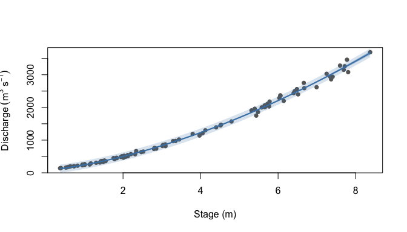

<!-- README.md is generated from README.Rmd. Please edit that file -->

# CSHShydRometry

<!-- badges: start -->

[](https://github.com/CSHS-CWRA/CSHShydRometry/actions/workflows/R-CMD-check.yaml)
[](https://app.codecov.io/gh/CSHS-CWRA/CSHShydRometry)
[](https://cran.r-project.org/web/licenses/MIT)
<!-- badges: end -->

Frequentist methods for fitting stage–discharge rating curves, with
confidence and prediction limits.

Derived from work by Dan Moore on rating-curve methods, restructured
into a model–predict form: every model is fitted by a `rc_*()`
constructor and summarised by a `predict()` method.

## Installation

``` r
remotes::install_github("CSHS-CWRA/CSHShydRometry")
```

## Fitting a curve

``` r
library(CSHShydRometry)

fit <- rc_nls(q, h, data = thompson)
fit
#> Rating curve model.
#> - Method: rc_nls

predict(fit, hpred = c(1, 3, 6), conflev = 0.95, predlev = 0.95)
#> # A tibble: 3 × 6
#>       h   fit ci_lwr ci_upr pi_lwr pi_upr
#>   <dbl> <dbl>  <dbl>  <dbl>  <dbl>  <dbl>
#> 1     1  243.   222.   264.   118.   368.
#> 2     3  832.   814.   850.   707.   957.
#> 3     6 2209.  2188.  2230.  2084.  2334.
```

Leave out `hpred` and `predict()` evaluates the curve over the observed
stage range, which is handy for plotting:

``` r
band <- predict(fit, conflev = 0.95, predlev = 0.95)
plot(q ~ h, data = thompson, pch = 16, col = "grey40",
     xlab = "Stage (m)", ylab = expression(Discharge ~ (m^3 ~ s^-1)))
polygon(c(band$h, rev(band$h)), c(band$pi_lwr, rev(band$pi_upr)),
        col = adjustcolor("steelblue", 0.2), border = NA)
polygon(c(band$h, rev(band$h)), c(band$ci_lwr, rev(band$ci_upr)),
        col = adjustcolor("steelblue", 0.4), border = NA)
lines(fit ~ h, data = band, col = "steelblue", lwd = 2)
```



Single-segment models: `rc_log_ols()` and `rc_log_nls()` fit a power law
on the log–log scale, `rc_nls()` on the natural scale, `rc_gnls()`
estimates the error variance as a power of the mean, and `rc_poly()` and
`rc_loess()` offer non-power-law alternatives.

Two-segment curves are fitted by `rc_nls_2seg()`, joined either
continuously (`config = "piecewise"`) or additively
(`config = "compound"`) at an estimated breakpoint.

## Consistent output

`predict()` returns the same columns whatever the model, method or
weighting: `h`, `fit`, and — when asked for — `ci_lwr`/`ci_upr` and
`pi_lwr`/`pi_upr`. Quantities that cannot be computed come back as `NA`
rather than as missing columns, so a batch of approaches stacks
directly:

``` r
fits <- list(
  log_ols = rc_log_ols(q, h, data = thompson),
  nls     = rc_nls(q, h, data = thompson),
  nls_cv  = rc_nls(q, h, data = thompson, wts_code = "prop"),
  poly    = rc_poly(q, h, data = thompson),
  loess   = rc_loess(q, h, data = thompson)
)
do.call(rbind, lapply(names(fits), function(nm) {
  cbind(model = nm, predict(fits[[nm]], hpred = 3, conflev = 0.95))
}))
#>     model h      fit   ci_lwr   ci_upr
#> 1 log_ols 3 815.1458 808.4432 821.9040
#> 2     nls 3 831.9720 813.7141 850.2299
#> 3  nls_cv 3 815.8217 805.8467 825.7967
#> 4    poly 3 835.1210 815.6177 854.6244
#> 5   loess 3 823.3323 796.4079 850.2566
```

## Weighting

Constructors taking `wts_code` offer three error models:

| `wts_code` | assumption |
|----|----|
| `"none"` | constant variance |
| `"prop"` | constant coefficient of variation, fitted by IRLS |
| `"spec"` | variances supplied by the user, e.g. from reported gauging uncertainties |

Under `"spec"` a new observation’s scatter is not identified by the fit,
so prediction limits are returned as `NA`.

## Intervals for two-segment curves

`predict.rc_nls_2seg()` takes a `method`:

| method | notes |
|----|----|
| `"delta"` (default) | linearised, fast, **unreliable near the breakpoint** |
| `"boot"` | resamples the gaugings and refits; slow, but trustworthy at the breakpoint |

The default warrants a word. A two-segment mean function is not
differentiable at the breakpoint, so the delta method’s linearisation
switches form there and the interval jumps. On one fitted curve the band
widened from 29 to 242 m³ s⁻¹ across the breakpoint, and in a simulation
study a nominal 95% delta interval covered the true curve only about
two-thirds of the time just above it, against roughly 97% for the
bootstrap. Away from the breakpoint the delta method behaves normally.

You can see it at Sauze, either side of the fitted breakpoint, with
weights from the reported gauging uncertainties:

``` r
sauze <- RBaM::SauzeGaugings
fit2 <- rc_nls_2seg(Q, H, data = sauze, kstart = 1,
                    wts_code = "spec", wts = 1 / sauze$uQ^2)
k <- fit2$pars[["k"]]
k
#> [1] 1.621688

hp <- k + c(-0.05, 0.05)
delta <- predict(fit2, hpred = hp, conflev = 0.95)
boot <- predict(fit2, hpred = hp, conflev = 0.95, method = "boot",
                B = 200, seed = 1)
data.frame(
  h = hp,
  delta_width = delta$ci_upr - delta$ci_lwr,
  boot_width = boot$ci_upr - boot$ci_lwr
)
#>          h delta_width boot_width
#> 1 1.571688    29.02079   52.25745
#> 2 1.671688   237.71489   58.78946
```

So `"delta"` for a quick look, and `"boot"` where the interval matters.

## Data

`thompson` ships with the package: 93 gaugings from Water Survey of
Canada station 08LF051, Thompson River. It is close to a single control,
so it suits the single-segment models; its two-segment fit converges
only with care.

For the two-segment models the examples and tests prefer the Ardeche at
Sauze, `RBaM::SauzeGaugings`, which has a clear change of control and a
reported uncertainty for every gauging. RBaM is a suggested dependency,
used only as a source of that data — none of the fitting here is
Bayesian, and the BaM engine is not needed.

## Scope

This package covers the frequentist methods only. Bayesian rating-curve
estimation, and a breakpoint-averaged interval method that removes the
jump described above, are deliberately left out for now.

An interval method that draws parameters from their asymptotic normal
distribution and pushes each draw through the model was tried and
dropped: where a segment is poorly identified, the sampled parameters
too often give impossible curves (negative or astronomically large
discharges).
