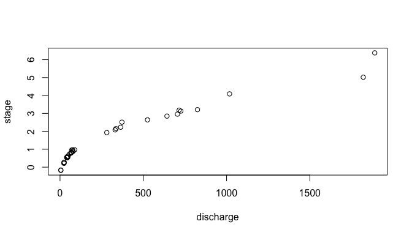

<!-- README.md is generated from README.Rmd. Please edit that file -->

# CSHShydRometry

<!-- badges: start -->

[](https://github.com/CSHS-CWRA/CSHShydRometry/actions/workflows/R-CMD-check.yaml)
[](https://app.codecov.io/gh/CSHS-CWRA/CSHShydRometry)
[](https://cran.r-project.org/web/licenses/MIT)
<!-- badges: end -->

A rating curve turns a river’s stage (its water level, which is easier
to record continuously) into discharge (the flow, which is not). It is
fitted to gaugings: occasions when both were measured. This package fits
rating curves by a range of statistical methods, and calculates
uncertainty associated with them.

## Installation

The package is not on CRAN yet. Get it from GitHub:

``` r
remotes::install_github("CSHS-CWRA/CSHShydRometry")
```

## Fitting a single-segment rating curve

``` r
library(CSHShydRometry)
```

The package comes with 93 gaugings from the Thompson River (Water Survey
of Canada station 08LF051). `stage` is in metres and `discharge` in
cubic metres per second. A few gaugings also carry a reported
uncertainty.

``` r
head(thompson)
#>         date stage discharge uncertainty_pct
#> 1 2023-03-22 0.376       141              NA
#> 2 2023-01-11 0.399       146             2.6
#> 3 2014-03-05 0.526       160              NA
#> 4 2011-02-25 0.567       172              NA
#> 5 2001-04-02 0.618       187              NA
#> 6 1995-03-17 0.645       197              NA
```

By convention, rating curves are drawn with stage on the vertical axis.
Discharge rises faster than stage, so the points bend over to the right:

``` r
plot(stage ~ discharge, data = thompson)
```


The classic rating curve is a power law relating discharge $Q$ to stage
$h$:

$$
Q = a (h - c)^b
$$

`rc_nls()` is one method, which fits this relationship by nonlinear
least squares:

``` r
fit <- rc_nls(discharge, stage, data = thompson)
```

Like the result of `lm()` or `glm()`, `fit` is a fitted-model object.
Printing it says what kind of model it is, and it works with the usual
tools, such as `coef()` and `predict()`. `?rating_curve` describes what
is inside.

``` r
fit
#> Rating curve model.
#> - Method: rc_nls
coef(fit)
#>          a          b          c 
#> 80.6686684  1.7131160 -0.9044139
```

Here $c$ is the stage at which the flow would stop, $b$ says how quickly
the flow grows as the water rises above that, and $a$ sets the scale: it
is the discharge when the water is one metre above $c$.

## Predicting discharge

`predict()` evaluates the curve at the stages you give it:

``` r
predict(fit, stage = c(1, 3, 6))
#> # A tibble: 3 × 2
#>   stage   fit
#>   <dbl> <dbl>
#> 1     1  243.
#> 2     3  832.
#> 3     6 2209.
```

Ask for a confidence level to get limits for the curve itself, and a
prediction level to get limits for a new gauging:

``` r
predict(fit, stage = c(1, 3, 6), conflev = 0.95, predlev = 0.95)
#> # A tibble: 3 × 6
#>   stage   fit ci_lwr ci_upr pi_lwr pi_upr
#>   <dbl> <dbl>  <dbl>  <dbl>  <dbl>  <dbl>
#> 1     1  243.   222.   264.   118.   368.
#> 2     3  832.   814.   850.   707.   957.
#> 3     6 2209.  2188.  2230.  2084.  2334.
```

Leave out `stage` to cover the whole range of the gaugings, which is
handy for plotting:

``` r
band <- predict(fit, conflev = 0.95, predlev = 0.95)

plot(stage ~ discharge, data = thompson)
lines(stage ~ fit, data = band)
lines(stage ~ pi_lwr, data = band, lty = 2)
lines(stage ~ pi_upr, data = band, lty = 2)
```


The dashed lines are the 95% prediction limits. The confidence limits
are there too, in `ci_lwr` and `ci_upr`, but on this scale they sit
almost on the curve.

## Other models

Every model has an `rc_*()` function and a `predict()` method:

- `rc_nls()`: power law, fitted on the natural scale.
- `rc_log_ols()`, `rc_log_nls()`: power law, fitted on the log–log
  scale.
- `rc_gnls()`: power law, with the scatter estimated as a power of the
  flow.
- `rc_poly()`, `rc_loess()`: a polynomial, or a smooth curve.
- `rc_nls_2seg()`: two power laws joined at a breakpoint (more below).

Swapping one model for another changes one line:

``` r
fit_poly <- rc_poly(discharge, stage, data = thompson)
predict(fit_poly, stage = c(1, 3, 6))
#> # A tibble: 3 × 2
#>   stage   fit
#>   <dbl> <dbl>
#> 1     1  244.
#> 2     3  835.
#> 3     6 2201.
```

`predict()` always gives back the same columns, so results from
different models can be stacked with `rbind()`:

``` r
rbind(
  predict(fit, stage = 3, conflev = 0.95),
  predict(fit_poly, stage = 3, conflev = 0.95)
)
#> # A tibble: 2 × 4
#>   stage   fit ci_lwr ci_upr
#>   <dbl> <dbl>  <dbl>  <dbl>
#> 1     3  832.   814.   850.
#> 2     3  835.   816.   855.
```

## Two-segment curves

Where the river’s control changes (say, when the water rises out of the
channel and over a floodplain), one power law is not enough. The Ardèche
at Sauze, from the RBaM package, is such a river. RBaM calls its columns
`H`, `Q` and `uQ`; here we give them the names used in this package.
Each gauging comes with its standard uncertainty, in cubic metres per
second:

``` r
sauze <- data.frame(
  stage = RBaM::SauzeGaugings$H,
  discharge = RBaM::SauzeGaugings$Q,
  uncertainty_sd = RBaM::SauzeGaugings$uQ
)
head(sauze)
#>   stage discharge uncertainty_sd
#> 1 -0.18       5.0           0.13
#> 2 -0.16       4.8           0.12
#> 3  0.22      24.0           0.60
#> 4  0.22      23.4           0.59
#> 5  0.27      24.0           0.60
#> 6  0.27      25.0           0.63
```

Below about 1 m the stage climbs steeply with discharge; above about 2 m
it climbs much more slowly. There are no gaugings in between, so where
the control changes has to be estimated:

``` r
plot(stage ~ discharge, data = sauze)
```



`rc_nls_2seg()` fits two power laws that meet at a breakpoint, $k$. Here
we weight each gauging by its reported uncertainty:

``` r
fit2 <- rc_nls_2seg(discharge, stage, data = sauze,
                    wts_code = "spec", wts = 1 / uncertainty_sd^2)
fit2$pars$k
#> [1] 1.621688
```

The fit is sensitive to where the breakpoint search starts, so by
default it tries several starting points and keeps the best.

### Limits near the breakpoint

For two-segment curves, `predict()` offers two ways to compute the
limits. The default, `method = "delta"`, is fast but unreliable near the
breakpoint: the curve has a corner there, and the method’s straight-line
approximation jumps across it. `method = "boot"` refits the curve to
resampled gaugings; it is slow, but it behaves at the breakpoint.

Just either side of the breakpoint, the delta band jumps and the
bootstrap band does not:

``` r
near_k <- fit2$pars$k + c(-0.05, 0.05)
delta <- predict(fit2, stage = near_k, conflev = 0.95)
boot <- predict(fit2, stage = near_k, conflev = 0.95, method = "boot", B = 200,
                seed = 1)

delta$ci_upr - delta$ci_lwr
#> [1]  29.02078 237.71491
boot$ci_upr - boot$ci_lwr
#> [1] 70.12559 77.24494
```

In a simulation study, a nominal 95% delta interval covered the true
curve only about two-thirds of the time just above the breakpoint,
against roughly 97% for the bootstrap. Away from the breakpoint the two
agree. So use `"delta"` for a quick look, and `"boot"` where the
interval matters.

## Acknowledgements

The name of this R package is in recognition of the support provided by
the [Canadian Society for Hydrological Sciences
(CSHS)](https://cwra.org/en/affiliates-programs/cshs/) which is an
affiliated society of the Canadian Water Resources Association (CWRA).
\## Contributing

Contributions are welcome; see [CONTRIBUTING.md](CONTRIBUTING.md).
Please note that this project is released with a [Contributor Code of
Conduct](CODE_OF_CONDUCT.md). By participating in this project you agree
to abide by its terms.
