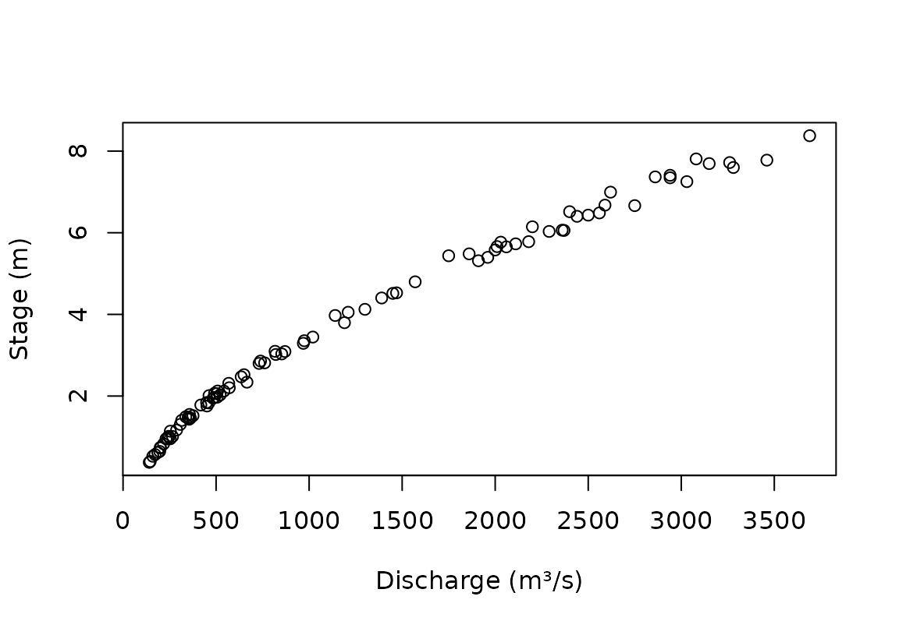
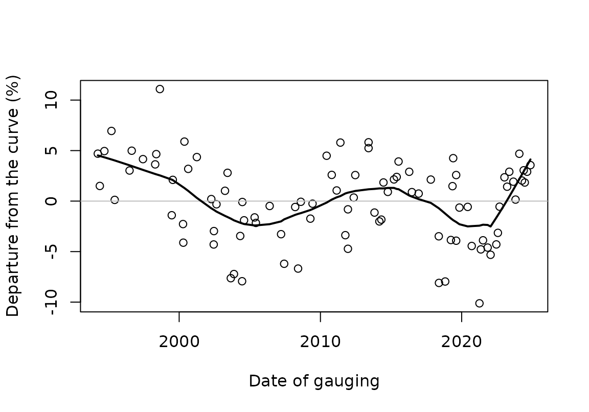
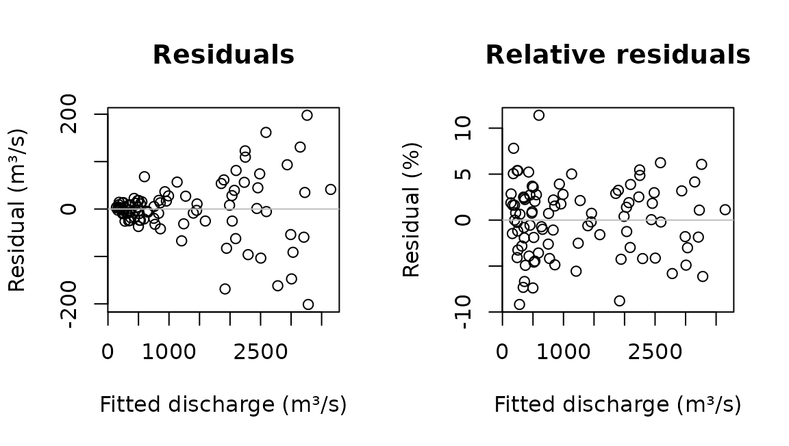
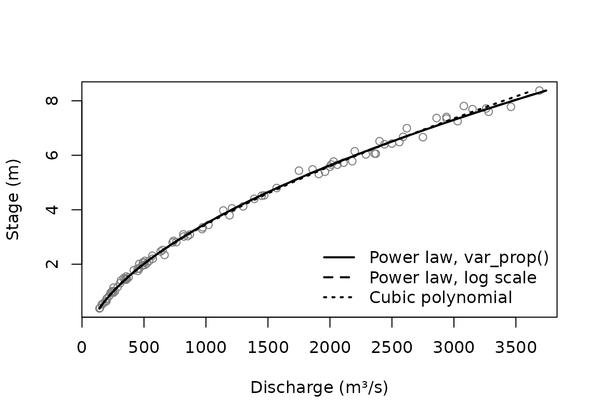
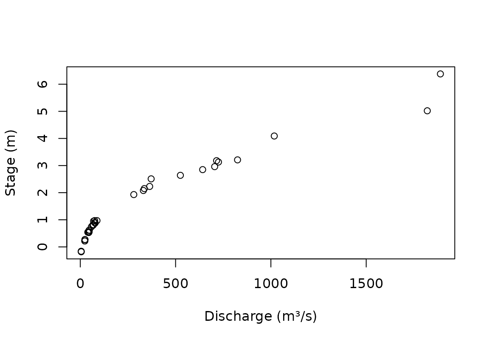
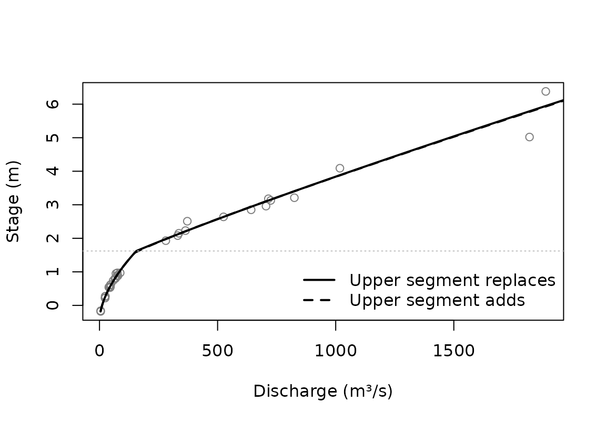

# Fitting rating curves

This vignette walks through the ways CSHShydRometry fits a rating curve:
the relationship between a river’s stage (its water level) and its
discharge (the flow). It starts by looking at the data, which tells you
which model to use, then fits single-segment curves in several ways, and
ends with a curve in two segments. How sure we can be about the fitted
curves is the subject of
[`vignette("uncertainty")`](https://cshs-cwra.github.io/CSHShydRometry/articles/uncertainty.md).

``` r

library(CSHShydRometry)
```

## The gaugings

A rating curve is fitted to gaugings: occasions when both stage and
discharge were measured. The package comes with 93 gaugings from the
Thompson River near Spences Bridge, British Columbia, made between 1994
and 2024.

``` r

thompson
#> # A tibble: 93 × 5
#>    date       stage discharge uncertainty_pct rating_table
#>    <date>     <dbl>     <dbl>           <dbl> <chr>       
#>  1 1994-03-29 1.01        266              NA NA          
#>  2 1994-05-20 5.58       2000              NA NA          
#>  3 1994-09-15 1.76        451              NA NA          
#>  4 1995-03-17 0.645       197              NA NA          
#>  5 1995-06-09 6.40       2440              NA NA          
#>  6 1996-06-27 6.03       2290              NA NA          
#>  7 1996-08-22 3.29        969              NA NA          
#>  8 1997-06-09 7.78       3460              NA NA          
#>  9 1998-04-21 1.97        506              NA NA          
#> 10 1998-05-19 5.78       2180              NA NA          
#> # ℹ 83 more rows
```

Rating curves are drawn with stage on the vertical axis:

``` r

plot(stage ~ discharge, data = thompson,
     xlab = "Discharge (m³/s)", ylab = "Stage (m)")
```



## Which gaugings to use

A rating curve describes the river while its channel stays the same.
Channels change, through erosion, deposition or work on the control, so
a curve is usually fitted to gaugings from one period of stable
conditions.

One way to check is to fit a model to the entire dataset and see whether
the gaugings systematically miss the curve over time. We’ll build that
model here with
[`rc_powerlaw_log()`](https://cshs-cwra.github.io/CSHShydRometry/reference/rc_powerlaw_log.md),
which is explained below. What matters here are its residuals, which are
on the log scale, so multiplied by 100 they are roughly percentage
departures from the curve.

``` r

fit_all <- rc_powerlaw_log(discharge, stage, data = thompson)
departure <- residuals(fit_all)

plot(thompson$date, 100 * departure,
     xlab = "Date of gauging", ylab = "Departure from the curve (%)")
abline(h = 0, col = "grey")
lines(lowess(thompson$date, 100 * departure, f = 0.3), lwd = 2)
```



The curve’s error depends on when the gaugings were made: its
predictions are too low in the 1990s, too high in the 2000s, and so on.
The Water Survey’s own rating changed too, as the `rating_table` column
records.

For a rating to use in practice, you would choose a stable period and
keep only its gaugings, for example with
`subset(thompson, rating_table == "11")`. This vignette uses all 93
gaugings to illustrate the methods, which is fine for that purpose, but
the fitted curves average over several ratings.

## Looking at the scatter

Before choosing a model, look at how the gaugings scatter about a fitted
curve. A loess smoother makes few assumptions about the curve’s shape,
so its residuals show the scatter fairly.

Fit the model and get the fitted values and the residuals.

``` r

smooth <- rc_loess(discharge, stage, data = thompson)
fitted_q <- fitted(smooth)
residual_q <- residuals(smooth)
```

Now check whether the residuals have an even spread about the curve.



Show the code

``` r

op <- par(mfrow = c(1, 2))
plot(
  fitted_q,
  residual_q,
  xlab = "Fitted discharge (m³/s)",
  ylab = "Residual (m³/s)",
  main = "Residuals"
)
abline(h = 0, col = "grey")
plot(
  fitted_q,
  100 * residual_q / fitted_q,
  xlab = "Fitted discharge (m³/s)",
  ylab = "Residual (%)",
  main = "Relative residuals"
)
abline(h = 0, col = "grey")
par(op)
```

The residuals fan out as the flow grows, while the relative residuals
stay roughly even. The scatter is roughly proportional to the flow: a
constant percentage, not a constant amount. That matters for the fit,
because ordinary least squares doesn’t perform as well when the
residuals scatter more with increasing flow.

There are two ways to allow for it, both below: model the variance, or
fit on the log scale.

## A power law on the original scale

The usual rating curve is a power law, $`Q = a (h - c)^b`$, where $`Q`$
is discharge and $`h`$ is stage. The model parameters are $`a`$, $`b`$,
and $`c`$, with $`c`$ being the offset: the stage at which the flow
would stop.
[`rc_powerlaw()`](https://cshs-cwra.github.io/CSHShydRometry/reference/rc_powerlaw.md)
fits this model by least squares on the original scale:

``` r

fit <- rc_powerlaw(discharge, stage, data = thompson)
coef(fit)
#>          a          b          c 
#> 80.6686509  1.7131161 -0.9044142
```

To improve the least squares estimation, the `variance` argument lets
you specify how you think the scatter changes with the flow. By default
it is the same at every flow
([`var_none()`](https://cshs-cwra.github.io/CSHShydRometry/reference/variance.md)).
With
[`var_prop()`](https://cshs-cwra.github.io/CSHShydRometry/reference/variance.md)
its standard deviation is assumed proportional to the flow, which suits
the Thompson gaugings better. Either way, the fit weights each gauging
by the reciprocal of its variance.

``` r

fit_prop <- rc_powerlaw(
  discharge,
  stage,
  data = thompson,
  variance = var_prop()
)
coef(fit_prop)
#>         a         b         c 
#> 52.487716  1.879973 -1.303340
```

It’s worth knowing about the extra gymnastics this takes. When we say
that the standard deviation of the flow is proportional to the flow
itself, we don’t mean the *observed* flow, but the *average* flow at a
given stage: the thing being predicted. That’s because we’re talking
about the (vertical) scatter around the *curve*. So the weights depend
on the fitted curve, and the fitted curve depends on the weights. To
deal with this, the fit is repeated, reweighting each time, until it
settles; hence “iteratively reweighted least squares” (IRLS). Here is
the number of iterations it took:

``` r

fit_prop$irls$iterations
#> [1] 5
```

[`var_power()`](https://cshs-cwra.github.io/CSHShydRometry/reference/variance.md)
goes one step further than
[`var_prop()`](https://cshs-cwra.github.io/CSHShydRometry/reference/variance.md),
and estimates the power of the flow to which the scatter is
proportional:

``` r

fit_power <- rc_powerlaw(
  discharge,
  stage,
  data = thompson,
  variance = var_power()
)
fit_power$variance$exponent
#> [1] 0.999845
```

An estimated power close to 1 supports
[`var_prop()`](https://cshs-cwra.github.io/CSHShydRometry/reference/variance.md).
The estimate can be unstable with few gaugings, so compare it with the
fit under
[`var_prop()`](https://cshs-cwra.github.io/CSHShydRometry/reference/variance.md).

When each gauging comes with its own reported uncertainty,
[`var_spec()`](https://cshs-cwra.github.io/CSHShydRometry/reference/variance.md)
uses it directly; there is an example with the two-segment curve below.
See
[`?variance`](https://cshs-cwra.github.io/CSHShydRometry/reference/variance.md)
for all the variance schemes.

## A power law on the log scale

Taking logs turns the power law into a straight line in $`\log(h - c)`$:

``` math
\log Q = \log a + b \log(h - c)
```

Equal scatter on the log scale is scatter proportional to the flow, so
[`rc_powerlaw_log()`](https://cshs-cwra.github.io/CSHShydRometry/reference/rc_powerlaw_log.md)
allows for the fanning out by its choice of scale, with no variance
scheme:

``` r

fit_log <- rc_powerlaw_log(discharge, stage, data = thompson)
coef(fit_log)
#>         a         b         c 
#> 52.398628  1.880339 -1.304109
```

Back on the original scale, this curve estimates the geometric mean
discharge at each stage, which is a little below the arithmetic mean.
`fit_log$a_corrected` holds two versions of $`a`$ corrected for that.

$`c`$ is the *offset*. For a single power law it is the stage at which
the flow would stop, but with several segments it no longer is, so the
package calls it the offset throughout. If it is known, say from a
survey of the control, give it as `offset` and only $`a`$ and $`b`$ are
estimated.
[`rc_powerlaw()`](https://cshs-cwra.github.io/CSHShydRometry/reference/rc_powerlaw.md)
takes `offset` too.

``` r

coef(rc_powerlaw_log(discharge, stage, data = thompson, offset = -1.3))
#>         a         b         c 
#> 52.655954  1.878378 -1.300000
```

## Other curve shapes

Not every rating follows a power law.
[`rc_poly()`](https://cshs-cwra.github.io/CSHShydRometry/reference/rc_poly.md)
fits a polynomial in stage, and
[`rc_loess()`](https://cshs-cwra.github.io/CSHShydRometry/reference/rc_loess.md)
a smooth curve with no set shape. Both accept the same variance schemes
as
[`rc_powerlaw()`](https://cshs-cwra.github.io/CSHShydRometry/reference/rc_powerlaw.md),
except
[`var_power()`](https://cshs-cwra.github.io/CSHShydRometry/reference/variance.md).

``` r

fit_cubic <- rc_poly(discharge, stage, data = thompson, degree = 3)
fit_smooth <- rc_loess(discharge, stage, data = thompson)
```

## Comparing the fits

Every fit has a [`predict()`](https://rdrr.io/r/stats/predict.html)
method, so the curves can be compared at chosen stages:

``` r

at <- c(1, 4, 8)
predict(fit_prop, new_stage = at)
#> # A tibble: 3 × 2
#>   stage   fit
#>   <dbl> <dbl>
#> 1     1  252.
#> 2     4 1208.
#> 3     8 3476.
predict(fit_cubic, new_stage = at)
#> # A tibble: 3 × 2
#>   stage   fit
#>   <dbl> <dbl>
#> 1     1  249.
#> 2     4 1226.
#> 3     8 3399.
```

[`predict()`](https://rdrr.io/r/stats/predict.html) returns the same
columns for every model, so the results stack. With the dplyr package
(not a dependency of this one), `bind_rows()` can label each row with
its model:

``` r

dplyr::bind_rows(
  power_prop = predict(fit_prop, new_stage = at),
  cubic = predict(fit_cubic, new_stage = at),
  .id = "model"
)
#> # A tibble: 6 × 3
#>   model      stage   fit
#>   <chr>      <dbl> <dbl>
#> 1 power_prop     1  252.
#> 2 power_prop     4 1208.
#> 3 power_prop     8 3476.
#> 4 cubic          1  249.
#> 5 cubic          4 1226.
#> 6 cubic          8 3399.
```

Without `new_stage`, [`predict()`](https://rdrr.io/r/stats/predict.html)
covers the range of the gaugings, which makes it easy to draw the
curves:

``` r

plot(stage ~ discharge, data = thompson, col = "grey50",
     xlab = "Discharge (m³/s)", ylab = "Stage (m)")
lines(stage ~ fit, data = predict(fit_prop), lwd = 2)
lines(stage ~ fit, data = predict(fit_log), lwd = 2, lty = 2)
lines(stage ~ fit, data = predict(fit_cubic), lwd = 2, lty = 3)
legend("bottomright", c("Power law, var_prop()", "Power law, log scale",
       "Cubic polynomial"), lty = 1:3, lwd = 2, bty = "n")
```



Within the range of the gaugings the curves barely differ. They part
company beyond it;
[`vignette("uncertainty")`](https://cshs-cwra.github.io/CSHShydRometry/articles/uncertainty.md)
takes that up.

## A curve in two segments

Where the control changes, for example when the water rises out of the
channel onto a floodplain, one power law is not enough.
[`rc_2seg_powerlaw()`](https://cshs-cwra.github.io/CSHShydRometry/reference/rc_2seg_powerlaw.md)
fits two power laws that meet at a breakpoint stage, $`k`$.

The Ardèche at Sauze, from the RBaM package, has such a change. RBaM
calls its columns `H`, `Q` and `uQ`; here they get the names used in
this package. Each gauging comes with its standard uncertainty, in cubic
meters per second.

``` r

sauze <- tibble::tibble(
  stage = RBaM::SauzeGaugings$H,
  discharge = RBaM::SauzeGaugings$Q,
  uncertainty_sd = RBaM::SauzeGaugings$uQ
)
plot(
  stage ~ discharge,
  data = sauze,
  xlab = "Discharge (m³/s)",
  ylab = "Stage (m)"
)
```



The reported uncertainties give the variances directly, through
[`var_spec()`](https://cshs-cwra.github.io/CSHShydRometry/reference/variance.md).
Below the breakpoint, $`h < k`$, the curve is a single power law,
$`Q = a_1 (h - c_1)^{b_1}`$. How the two segments combine above it,
$`h \ge k`$, is set by `combine`. With `"replace"` (the default), the
upper power law takes over from the lower one:

``` math
Q = a_2 (h - c_2)^{b_2},
\qquad \text{where } a_2 = \frac{a_1 (k - c_1)^{b_1}}{(k - c_2)^{b_2}},
```

so that the two meet at the breakpoint. With `"add"`, the upper power
law adds to the discharge the lower one carries at the breakpoint, as
when flow spills onto a floodplain:

``` math
Q = a_1 (k - c_1)^{b_1} + a_2 (h - k)^{b_2}.
```

``` r

fit_repl <- rc_2seg_powerlaw(
  discharge, stage,
  data = sauze,
  variance = var_spec(sauze$uncertainty_sd^2)
)
fit_add <- rc_2seg_powerlaw(
  discharge, stage,
  data = sauze,
  combine = "add",
  variance = var_spec(sauze$uncertainty_sd^2)
)
c(
  replace = fit_repl$curve_parameters$k,
  add = fit_add$curve_parameters$k
)
#>  replace      add 
#> 1.621688 1.564349
```

The fit is sensitive to where the search for the breakpoint starts, so
by default it tries several starting values and keeps the best. What
each start led to is recorded:

``` r

fit_repl$kstart_search
#> # A tibble: 10 × 3
#>    kstart      k  loss
#>     <dbl>  <dbl> <dbl>
#>  1  0.573  0.713  139.
#>  2  0.924 NA       NA 
#>  3  1.28   1.62   127.
#>  4  1.63  NA       NA 
#>  5  1.98  NA       NA 
#>  6  2.33  NA       NA 
#>  7  2.68   1.62   127.
#>  8  3.03   1.62   127.
#>  9  3.39   1.62   127.
#> 10  3.74   1.62   127.
```

``` r

plot(stage ~ discharge, data = sauze, col = "grey50",
     xlab = "Discharge (m³/s)", ylab = "Stage (m)")
lines(stage ~ fit, data = predict(fit_repl), lwd = 2)
lines(stage ~ fit, data = predict(fit_add), lwd = 2, lty = 2)
abline(h = fit_repl$curve_parameters$k, col = "grey", lty = 3)
legend("bottomright", c("Upper segment replaces", "Upper segment adds"),
       lty = 1:2, lwd = 2, bty = "n")
```



Gaugings are sparse near the breakpoint at Sauze, so where exactly it
lies is uncertain, which affects the limits on the curve there; see
[`vignette("uncertainty")`](https://cshs-cwra.github.io/CSHShydRometry/articles/uncertainty.md).
