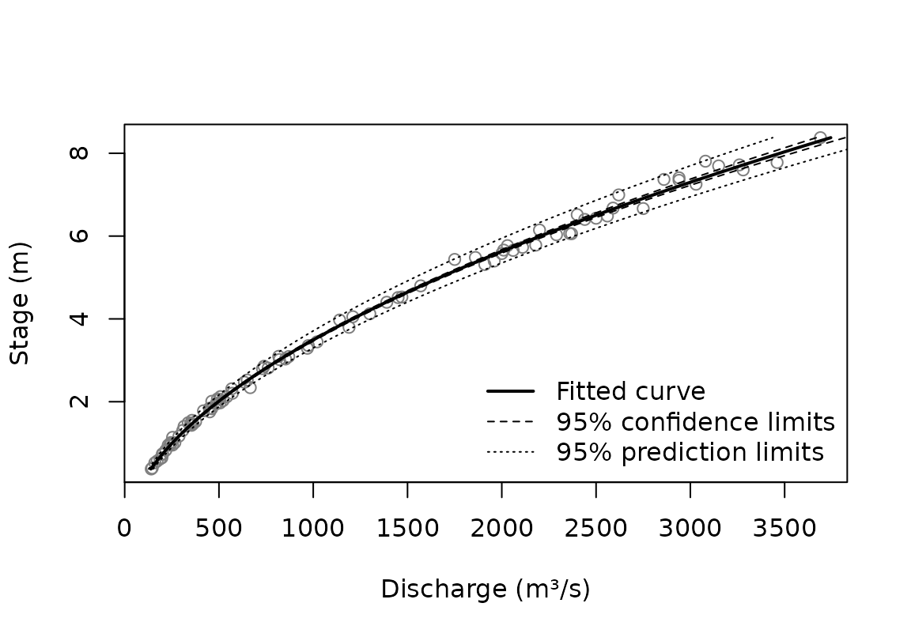
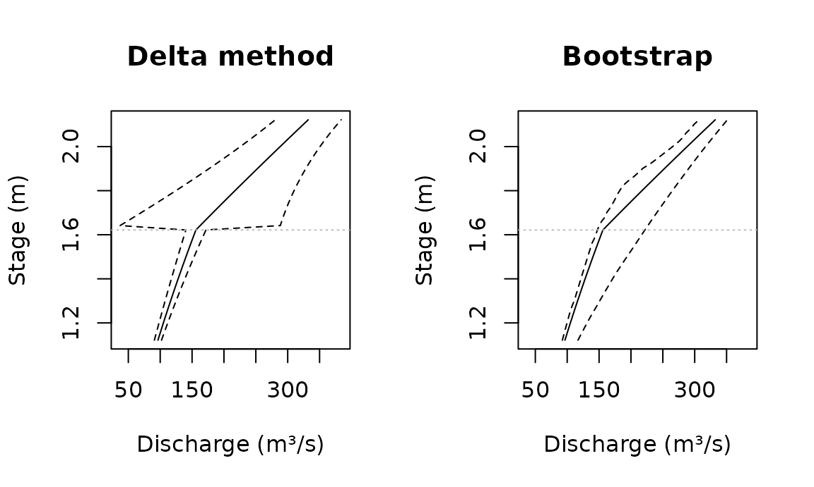

# Uncertainty in predicted discharge

A rating curve turns a recorded stage into a discharge, and that
discharge is uncertain. This vignette shows how CSHShydRometry puts
limits on it, what the limits mean, and where they can mislead. The fits
themselves are covered in
[`vignette("fitting")`](https://cshs-cwra.github.io/CSHShydRometry/articles/fitting.md),
which also explains why the Thompson gaugings used here illustrate the
methods rather than give a rating for any one period.

``` r

library(CSHShydRometry)
```

## Two kinds of limits

[`predict()`](https://rdrr.io/r/stats/predict.html) gives two kinds of
limits, each at a level you choose:

- **Confidence limits** (`conflev`) bound how “wobbly” the *curve* is:
  how much it could differ had it been fit to a different set of
  gaugings. They reflect how well the gaugings pin the curve down, and
  they narrow as more gaugings are collected.
- **Prediction limits** (`predlev`) bound what flow could reasonably
  materialize for a given stage. They add the scatter of individual
  gaugings about the curve, and do not narrow below that scatter however
  many gaugings there are. They are always wider than confidence limits.

``` r

fit <- rc_powerlaw(
  discharge, stage,
  data = thompson,
  variance = "prop"
)
predict(fit, new_stage = c(1, 4, 8), conflev = 0.95, predlev = 0.95)
#> # A tibble: 3 × 6
#>   stage   fit ci_lwr ci_upr pi_lwr pi_upr
#>   <dbl> <dbl>  <dbl>  <dbl>  <dbl>  <dbl>
#> 1     1  252.   249.   255.   232.   272.
#> 2     4 1208.  1195.  1222.  1111.  1306.
#> 3     8 3476.  3410.  3542.  3191.  3761.
```

Which to use depends on the question. Discharge averaged over a period,
where the scatter of individual gaugings largely cancels, calls for
confidence limits. Discharge at a particular moment calls for prediction
limits.

``` r

band <- predict(fit, conflev = 0.95, predlev = 0.95)

plot(stage ~ discharge, data = thompson, col = "grey50",
     xlab = "Discharge (m³/s)", ylab = "Stage (m)")
lines(stage ~ fit, data = band, lwd = 2)
lines(stage ~ ci_lwr, data = band, lty = 2)
lines(stage ~ ci_upr, data = band, lty = 2)
lines(stage ~ pi_lwr, data = band, lty = 3)
lines(stage ~ pi_upr, data = band, lty = 3)
legend("bottomright", c("Fitted curve", "95% confidence limits",
       "95% prediction limits"), lty = 1:3, lwd = c(2, 1, 1), bty = "n")
```



## The variance scheme shapes the limits

The variance scheme is a statement about the scatter, so it decides how
the prediction limits change with the flow. With
[`var_none()`](https://cshs-cwra.github.io/CSHShydRometry/reference/variance.md)
the scatter is the same at every flow; with
[`var_prop()`](https://cshs-cwra.github.io/CSHShydRometry/reference/variance.md)
it grows in proportion to the flow.

Let’s make a function to calculate prediction interval widths.

``` r

pi_widths <- function(fit, at) {
  p <- predict(fit, new_stage = at, predlev = 0.95)
  p$pi_upr - p$pi_lwr
}
```

Now apply that function to see how the widths differ:

``` r

at <- c(1, 8)
fit_none <- rc_powerlaw(discharge, stage, data = thompson)
tibble::tibble(
  stage = at,
  none = pi_widths(fit_none, at = at),
  prop = pi_widths(fit, at = at)
)
#> # A tibble: 2 × 3
#>   stage  none  prop
#>   <dbl> <dbl> <dbl>
#> 1     1  250.  40.7
#> 2     8  261. 570.
```

Under
[`var_none()`](https://cshs-cwra.github.io/CSHShydRometry/reference/variance.md)
the prediction band is nearly as wide at low flow as at high flow, which
is implausible here: the gaugings in
[`vignette("fitting")`](https://cshs-cwra.github.io/CSHShydRometry/articles/fitting.md)
scatter in proportion to the flow. Under
[`var_prop()`](https://cshs-cwra.github.io/CSHShydRometry/reference/variance.md)
the band is narrow at low flow and wide at high flow, as the gaugings
are.

Under
[`var_spec()`](https://cshs-cwra.github.io/CSHShydRometry/reference/variance.md),
each gauging’s variance is supplied, up to a common factor, rather than
modelled, so the fit says nothing about the scatter of a new gauging.
Its prediction limits come back as `NA`, while its confidence limits are
computed as usual.

## What the limits assume

The limits use the *t* distribution, which assumes the gaugings scatter
normally about the curve. Confidence limits depend on this only mildly,
because the estimates average over many gaugings. Prediction limits
depend on it directly: they are only as good as the assumed shape of the
scatter, and if it is skewed or has heavy tails they can miss,
especially at high levels such as 0.99. So look at the residuals before
relying on prediction limits. The scaled residuals, each divided by its
estimated standard deviation, are the ones to check. Here, for the power
law under
[`var_prop()`](https://cshs-cwra.github.io/CSHShydRometry/reference/variance.md),
they look roughly normal according to a Q-Q plot:

``` r

scaled <- residuals(fit, type = "scaled")
qqnorm(scaled, main = "Residuals, in standard deviations")
qqline(scaled)
```


Even with normal scatter, the curve is nonlinear in its parameters, so
its estimate is not exactly normal. That affects confidence limits most,
and prediction limits less. With plenty of gaugings the estimate is
close to normal, and the delta method, which the limits use, works well.
In practice, a 95% interval from most fits covers the truth roughly, not
exactly, 95% of the time; see
[`?predict.rc_powerlaw`](https://cshs-cwra.github.io/CSHShydRometry/reference/predict.rc_powerlaw.md).

## Fits on the log scale

[`rc_powerlaw_log()`](https://cshs-cwra.github.io/CSHShydRometry/reference/rc_powerlaw_log.md)
works on the log scale, where the limits are symmetric. Transformed back
to discharge they are lopsided, stretching further above the curve than
below it:

``` r

fit_log <- rc_powerlaw_log(discharge, stage, data = thompson)
p <- predict(fit_log, new_stage = 8, predlev = 0.95)
c(below = p$fit - p$pi_lwr, above = p$pi_upr - p$fit)
#>    below    above 
#> 274.3804 297.9139
```

The curve itself estimates the geometric mean discharge, which is below
the arithmetic mean by a factor that grows with the scatter. With
scatter of about 4% here, the difference is small:

``` r

fit_log$a_corrected / fit_log$curve_parameters$a
#>      nbc      dbc 
#> 1.000813 1.000784
```

### The offset

When the offset, $`c`$, is estimated, its uncertainty is part of the
limits. Holding it fixed removes that part. That is right when $`c`$ is
known independently, say from a survey of the control. Fixing it at the
value estimated from the same gaugings, though, gives the same curve
with limits that are too narrow:

``` r

fixed <- rc_powerlaw_log(
  discharge, stage,
  data = thompson,
  offset = fit_log$curve_parameters$c
)
ci_widths <- function(fit, at) {
  p <- predict(fit, new_stage = at, conflev = 0.95)
  p$ci_upr - p$ci_lwr
}
c(c_estimated = ci_widths(fit_log, 3), c_fixed = ci_widths(fixed, 3))
#> c_estimated     c_fixed 
#>    20.02188    13.46079
```

## Beyond the gaugings

Limits are only as good as the model, and the model is only checked
where there are gaugings. Beyond them, the choice of curve matters more
than any limit suggests. Here three curves that agree within the
gaugings are taken half again past the highest one:

``` r

top <- max(thompson$stage)
beyond <- seq(top, 1.5 * top, length.out = 50)
fits <- list(
  "Power law" = fit,
  "Cubic polynomial" = rc_poly(
    discharge,
    stage,
    data = thompson,
    degree = 3
  ),
  "Loess" = rc_loess(discharge, stage, data = thompson)
)
curves <- lapply(fits, predict, new_stage = beyond)

plot(
  NULL,
  xlim = range(sapply(curves, function(p) range(p$fit))),
  ylim = range(beyond),
  xlab = "Discharge (m³/s)",
  ylab = "Stage (m)"
)
for (i in seq_along(curves)) {
  lines(stage ~ fit, data = curves[[i]], lty = i, lwd = 2)
}
legend(
  "bottomright",
  names(fits),
  lty = seq_along(fits),
  lwd = 2,
  bty = "n"
)
```


The power law follows the physics of flow through a control, so it is
the safer guide for modest extrapolation. A polynomial or loess curve
has no such basis outside the data. None of their limits accounts for
the chance that the control itself changes at higher stages.

## Two-segment curves: limits near the breakpoint

For a two-segment curve,
[`predict()`](https://rdrr.io/r/stats/predict.html) offers two methods.
The default, `method = "delta"`, approximates the curve by a straight
line in its parameters. That works well away from the breakpoint, but
the curve has a corner there, and the approximation jumps across it.
`method = "boot"` refits the curve to resampled gaugings instead, which
makes no such approximation.

``` r

sauze <- tibble::tibble(
  stage = RBaM::SauzeGaugings$H,
  discharge = RBaM::SauzeGaugings$Q,
  uncertainty_sd = RBaM::SauzeGaugings$uQ
)
fit2 <- rc_2seg_powerlaw(
  discharge,
  stage,
  data = sauze,
  variance = var_spec(sauze$uncertainty_sd^2)
)
k <- fit2$curve_parameters$k
near_k <- seq(k - 0.5, k + 0.5, length.out = 51)

bands <- list(
  "Delta method" = predict(fit2, new_stage = near_k, conflev = 0.95),
  "Bootstrap" = predict(
    fit2,
    new_stage = near_k,
    conflev = 0.95,
    method = "boot",
    B = 200,
    seed = 1
  )
)
```

The two 95% confidence bands either side of the breakpoint, marked by
the dotted line:

``` r

discharge_range <- range(sapply(bands, function(b) {
  range(b$ci_lwr, b$ci_upr)
}))
op <- par(mfrow = c(1, 2))
for (method in names(bands)) {
  band <- bands[[method]]
  plot(
    stage ~ fit,
    data = band,
    type = "l",
    xlim = discharge_range,
    main = method,
    xlab = "Discharge (m³/s)",
    ylab = "Stage (m)"
  )
  lines(stage ~ ci_lwr, data = band, lty = 2)
  lines(stage ~ ci_upr, data = band, lty = 2)
  abline(h = k, col = "grey", lty = 3)
}
```



``` r

par(op)
```

The delta band jumps at the breakpoint: just above it, the band is
several times wider than just below. The jump comes from the
approximation, not the data, and the bootstrap band has none. In a
simulation study, a nominal 95% delta interval covered the true curve
only about two-thirds of the time just above the breakpoint, against
roughly 97% for the bootstrap.

The bootstrap costs a full refit per resample, and the refits repeat the
search over starting breakpoints. So use `"delta"` for a quick look, and
`"boot"` where the limits near the breakpoint matter.
